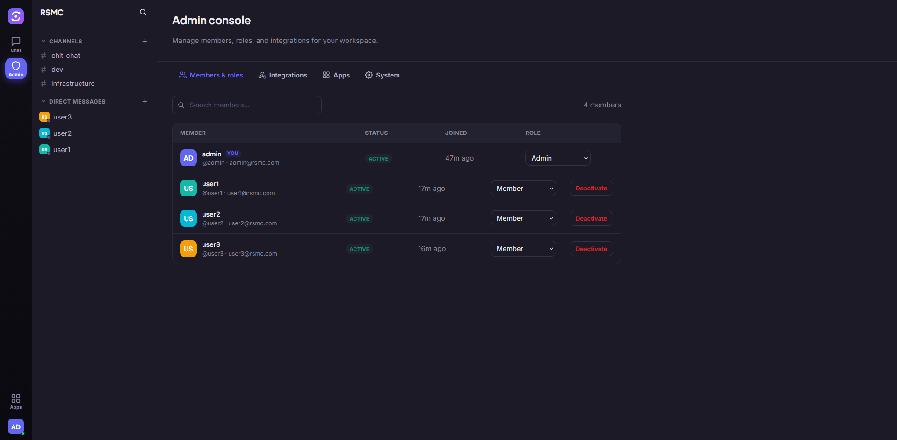
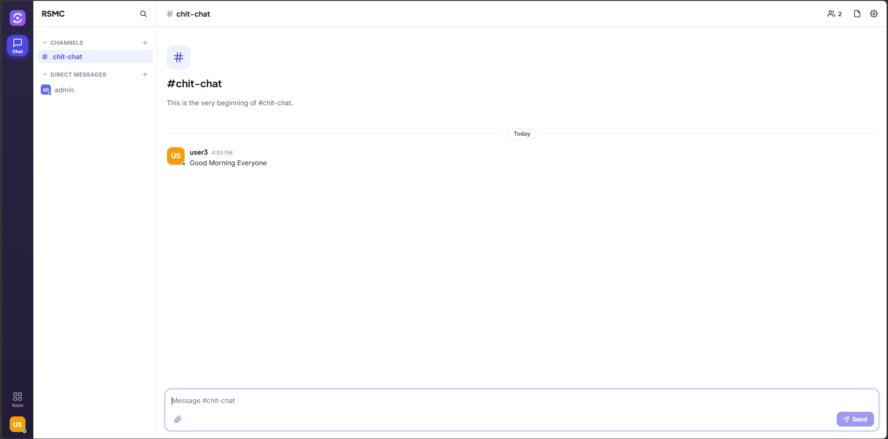

# RSMC

**RSMC** is a modern team-collaboration client — channels, direct messages,
threads, file sharing, presence, notifications, and an admin console — built as a
single-page React app on top of the [`rsmc-engine`](../rsmc-engine) backend.

<p align="center">
  
  
</p>

---

## Quick start

RSMC is a frontend; it needs the `rsmc-engine` backend running.

**1. Start the backend** (from the `rsmc-engine` directory):

```bash
docker compose up --build
# engine listens on http://localhost:8080
```

**2. Start RSMC:**

```bash
cd rsmc
npm install
npm run dev
# open http://localhost:5173
```

The Vite dev server proxies `/api`, the WebSocket, `/healthz`, and `/readyz` to
the backend, so the browser talks to a single origin with no CORS setup.

**3. Create the first account.** The first person to sign up becomes the
workspace **admin** automatically (this is enforced by the engine). Everyone who
signs up afterward is a **member**.

### Pointing at a different backend

```bash
VITE_PROXY_TARGET=http://192.168.1.50:8080 npm run dev
```

### Production build

```bash
npm run build      # outputs static assets to dist/
npm run preview    # serve the built bundle locally
```

Serve `dist/` from any static host. In production, put RSMC and the engine
behind the same origin (or configure the engine's `CORS_ORIGINS`) so `/api`
resolves to the backend.

---

## Roles & permissions (why a second user "can't do much")

This is intended behavior from the backend, and RSMC now surfaces it clearly
instead of hiding it. There are two independent layers:

**System roles** (workspace-wide):

| Role | Can do |
| --- | --- |
| **admin** | Everything: manage users & roles, deactivate accounts, manage workspace webhooks, plus all member abilities. The first signup is admin. |
| **member** | Create channels, send messages, upload files, read, manage their own messages. |
| **guest** | Send and read messages, manage their own messages. Cannot create channels or upload files. |

**Channel roles** (per channel membership):

| Role | Can do |
| --- | --- |
| **owner** | The channel's creator. Edit the channel, add/remove members, create channel-scoped webhooks. |
| **admin** | Same channel-management abilities as owner. |
| **member** | Participate (read, post, reply, react) only. |

So a second user who is a plain **member** of the workspace and a plain
**member** of a channel genuinely cannot add others to that channel or change
roles — that requires being the channel owner/admin or a workspace admin. In
RSMC:

- The **Members** panel shows an explanatory note and hides the add/remove
  controls when you lack channel-admin rights.
- **Create channel** is blocked with a message for guests.
- The **Admin** console only appears in the rail for workspace admins, and
  refuses to render for anyone else.

To give another user more power, sign in as an admin → **Admin → Members &
roles** → change their role, or have a channel owner add them and promote them.

### Admin console

The admin console (visible only to workspace admins) has three tabs:

- **Members & roles** — search users, change system roles, deactivate and reactivate accounts. Deactivating ends the user's active sessions and blocks sign-in; reactivating restores access. You can't change your own role or deactivate yourself (prevents self-lockout).
- **Integrations** — create and manage outgoing webhooks (signed HTTP callbacks
  on message events), with a one-time signing-secret reveal.
  **Apps** — admin-curated quick links to your team's tools (GitHub, GitLab, etc.), one click away in the sidebar.
- **System** — create database backups and restore from them. You can leave the
  path blank for an auto-named, timestamped dump, or specify a filename/path
  (constrained to the server's backups directory). Restore is destructive and
  asks for explicit confirmation. This requires the PostgreSQL client tools on
  the backend, which the provided Docker image installs.

### Settings & themes

Click your avatar in the bottom-left rail → the gear icon opens **Settings**.
Appearance offers **Light**, **Dark**, and **System** (follows your OS) themes;
your choice is remembered on the device. The Settings panel is built to grow —
notifications, language, and accessibility options slot in as new sections.

---

## Architecture

```
src/
  api/
    client.js        fetch wrapper: auth headers, JSON, transparent 401 refresh-retry
    endpoints.js     typed map of every rsmc-engine REST endpoint
    realtime.js      WebSocket client: reconnect/backoff, re-subscribe, heartbeat
  app/
    App.jsx          providers + gate (boot → auth → workspace)
  context/
    AuthContext.jsx  session, token storage, /users/me boot, socket lifecycle
    ToastContext.jsx lightweight toast notifications
  hooks/
    useRealtime.js   subscribe to socket events / connection status
    useChannelMembers.js  member list + derived channel-admin rights
  lib/
    permissions.js   mirrors the engine's authz rules (single source of truth for the UI)
    format.js        names, timestamps, file sizes, mentions, avatar colors
  components/
    common/          Icon, Avatar, Modal/Loading/EmptyState/RoleBadge
    sidebar/         WorkspaceRail, Sidebar
    chat/            ChannelScreen, Header, MessageList, Message, Composer,
                     ThreadPanel, MembersPanel, FilesPanel
    modals/          CreateChannel, NewDirect, BrowseChannels, Profile, ChannelSettings
    admin/           AdminConsole, AdminMembers, AdminWebhooks
  views/
    AuthView.jsx     login / signup
    Workspace.jsx    main coordinator (channels, presence, unread, modals)
  styles/
    base.css         design tokens + primitives (buttons, fields, badges, toasts)
    app.css          layout + every component's styles
```

### Design notes

- **No router.** RSMC is a single coordinated view (`Workspace`) that swaps
  between the chat surface and the admin console. This keeps state central and
  the bundle small; a router can be added later without restructuring.
- **`permissions.js` is the contract.** The UI never guesses. Every gated
  affordance asks the same helpers that mirror the engine, so the client and
  server agree on what's allowed.
- **Realtime is resilient.** The socket reconnects with backoff, re-subscribes
  to active channels, and sends heartbeats; the connection status is shown as a
  dot on the workspace rail.
- **API response shapes match the engine exactly** — status replies are
  `{ ok: true }`, unread is `{ unread: N }`, signup requires `display_name`, etc.

---

## Extending RSMC

The structure is built to grow:

- **New REST calls** → add to `src/api/endpoints.js`.
- **New realtime events** → handle in `src/api/realtime.js` consumers via
  `useRealtime(type, handler)`.
- **New permissions** → add a helper in `src/lib/permissions.js` and use it to
  gate UI; this keeps authorization logic in one place.
- **New admin tooling** → add a tab to `src/components/admin/AdminConsole.jsx`.
- **New side panels** (pinned items, search, channel info) → follow the
  `rightpanel` pattern used by `MembersPanel` / `FilesPanel` / `ThreadPanel`.
- **Theming** → all colors, type, spacing, and radii are CSS variables in
  `base.css`; a dark theme is a variable swap away.

---

## Environment

| Variable | Default | Purpose |
| --- | --- | --- |
| `VITE_PROXY_TARGET` | `http://localhost:8080` | Backend origin for the dev proxy. |

See `.env.example`. (Only build-time/dev variables are needed; RSMC reads
all runtime data from the backend.)

---

## Tech

React 18 · Vite 5 · plain CSS (no UI framework) · the browser `fetch` and
`WebSocket` APIs. No global state library — React context is enough for this
surface.
